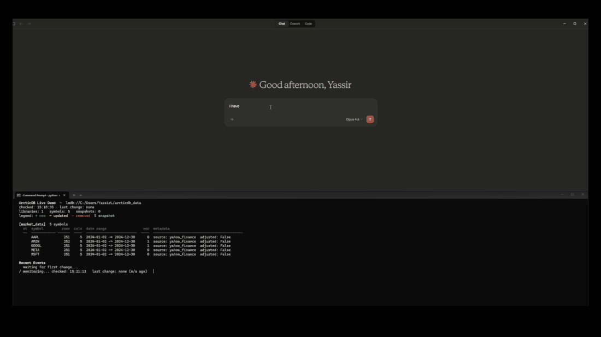

<div align="center">
  <h1>arcticdb-mcp</h1>
  <p><strong>An MCP server for structured read/write access to ArcticDB.</strong></p>
  <p>
    <a href="https://pypi.org/project/arcticdb-mcp/"></a>
    <a href="https://pypi.org/project/arcticdb-mcp/"></a>
    <a href="LICENSE"></a>
  </p>
  <p>
    <a href="#overview">Overview</a> •
    <a href="#demo-video">Demo</a> •
    <a href="#quickstart">Quick Start</a> •
    <a href="#configuration">Configuration</a> •
    <a href="#tools">Tools</a> •
    <a href="#development">Development</a>
  </p>
</div>

## Overview

`arcticdb-mcp` gives AI assistants structured access to [ArcticDB](https://github.com/man-group/ArcticDB) for versioned DataFrame workflows: symbol reads/writes, snapshots, metadata, query operations, and batch operations.

## Table of Contents

- [Demo Video](#demo-video)
- [Quickstart](#quickstart)
- [Installation](#installation)
- [Configuration](#configuration)
- [Run Modes](#run-modes)
- [Tools](#tools)
- [Example Prompts](#example-prompts)
- [Development](#development)
- [Community Backlog](#community-backlog)
- [Contributing](#contributing)
- [License](#license)

## Demo Video

Watch the live `watch db` demo:

<p align="center">
  <a href="demo/media/arcticdb-live-demo.mp4">
    
  </a>
</p>

Click the preview to open the full video:  
[`demo/media/arcticdb-live-demo.mp4`](demo/media/arcticdb-live-demo.mp4)

## Quickstart

1. Install and run with `uvx` (recommended):

```bash
uvx arcticdb-mcp
```

2. Configure your MCP client (Claude Desktop / Cursor / Windsurf / Continue):

```json
{
  "mcpServers": {
    "arcticdb": {
      "command": "uvx",
      "args": ["arcticdb-mcp"],
      "env": {
        "ARCTICDB_URI": "lmdb:///path/to/your/database"
      }
    }
  }
}
```

3. Ask your assistant:

- "Show me the last 5 rows of AAPL in library finance"
- "Create a snapshot of finance before I update symbols"
- "List versions for symbol ES_intraday"

## Installation

Choose one:

```bash
# Recommended
uvx arcticdb-mcp

# Or
pipx install arcticdb-mcp

# Or
pip install arcticdb-mcp
```

Python requirement: `>=3.9`

## Configuration

Set `ARCTICDB_URI` in MCP client config or environment.

### URI examples

- Local LMDB (Linux/macOS): `lmdb:///path/to/db`
- Local LMDB (Windows): `lmdb://C:/path/to/db`
- AWS S3: `s3://s3.amazonaws.com:bucket?region=us-east-1&access=KEY&secret=SECRET`
- Azure Blob: `azure://AccountName=X;AccountKey=Y;Container=Z`
- S3-compatible (MinIO, etc.): `s3://your-endpoint:bucket?access=KEY&secret=SECRET`

You can also use a `.env` file:

```env
ARCTICDB_URI=lmdb:///path/to/db
```

## Run Modes

### stdio (default)

This is the default mode used by desktop MCP clients.

```bash
ARCTICDB_URI=lmdb:///path/to/db python -m arcticdb_mcp
```

### HTTP / SSE

Set `ARCTICDB_MCP_PORT` to run over HTTP/SSE:

```bash
ARCTICDB_URI=lmdb:///path/to/db ARCTICDB_MCP_PORT=8000 python -m arcticdb_mcp
```

Endpoint:

```text
http://localhost:8000/sse
```

## Tools

Current server exposes 48 tools.

### Arctic and Libraries

| Tool | File | What it does |
|---|---|---|
| `get_uri` | `arcticdb_mcp/tools/arctic_tools.py` | Return the ArcticDB URI used by this MCP server connection. |
| `describe` | `arcticdb_mcp/tools/arctic_tools.py` | Return a compact summary of the ArcticDB store. |
| `modify_library_option` | `arcticdb_mcp/tools/arctic_tools.py` | Modify a configurable library option. |
| `list_libraries` | `arcticdb_mcp/tools/library_tools.py` | List all libraries in the Arctic instance. |
| `create_library` | `arcticdb_mcp/tools/library_tools.py` | Create a new library with the given name. |
| `delete_library` | `arcticdb_mcp/tools/library_tools.py` | Delete a library and all its underlying data permanently. |
| `library_exists` | `arcticdb_mcp/tools/library_tools.py` | Check whether a library with the given name exists. |
| `get_library` | `arcticdb_mcp/tools/library_tools.py` | Return the name and full list of symbols stored in a library. |
| `get_library_options` | `arcticdb_mcp/tools/maintenance_tools.py` | Return non-enterprise library options. |
| `get_enterprise_options` | `arcticdb_mcp/tools/maintenance_tools.py` | Return enterprise library options. |

### Symbols

| Tool | File | What it does |
|---|---|---|
| `list_symbols` | `arcticdb_mcp/tools/symbol_tools.py` | List all symbol names stored in the given library. |
| `symbol_exists` | `arcticdb_mcp/tools/symbol_tools.py` | Check whether a symbol exists in the given library. |
| `read_symbol` | `arcticdb_mcp/tools/symbol_tools.py` | Read a symbol's full data as row records with index included. |
| `head_symbol` | `arcticdb_mcp/tools/symbol_tools.py` | Return the first `n` rows of a symbol (default 5). |
| `tail_symbol` | `arcticdb_mcp/tools/symbol_tools.py` | Return the last `n` rows of a symbol (default 5). |
| `write_symbol` | `arcticdb_mcp/tools/symbol_tools.py` | Write data to a symbol, creating a new version. |
| `append_symbol` | `arcticdb_mcp/tools/symbol_tools.py` | Append rows to an existing symbol, creating a new version. |
| `update_symbol` | `arcticdb_mcp/tools/symbol_tools.py` | Update a date range of a timeseries symbol, creating a new version. |
| `delete_symbol` | `arcticdb_mcp/tools/symbol_tools.py` | Delete a symbol and all its versions from the library. |
| `delete_data_in_range` | `arcticdb_mcp/tools/symbol_tools.py` | Delete rows within a date range from a timeseries symbol, creating a new version. |
| `get_symbol_info` | `arcticdb_mcp/tools/symbol_tools.py` | Return schema, row count, date range, and metadata summary for a symbol. |
| `list_versions` | `arcticdb_mcp/tools/symbol_tools.py` | List all versions of a symbol with version number and write timestamp. |
| `read_metadata` | `arcticdb_mcp/tools/symbol_tools.py` | Read only metadata for a symbol without loading its data. |
| `write_metadata` | `arcticdb_mcp/tools/symbol_tools.py` | Update metadata for a symbol without modifying its data. |

### Batch Operations

| Tool | File | What it does |
|---|---|---|
| `write_batch` | `arcticdb_mcp/tools/batch_tools.py` | Write multiple symbols in one call. |
| `append_batch` | `arcticdb_mcp/tools/batch_tools.py` | Append to multiple symbols in one call. |
| `update_batch` | `arcticdb_mcp/tools/batch_tools.py` | Update multiple symbols in one call. |
| `delete_batch` | `arcticdb_mcp/tools/batch_tools.py` | Delete multiple symbols or symbol versions in one call. |
| `read_batch` | `arcticdb_mcp/tools/batch_tools.py` | Read multiple symbols in one call. |
| `read_metadata_batch` | `arcticdb_mcp/tools/batch_tools.py` | Read metadata for multiple symbols in one call. |
| `get_description_batch` | `arcticdb_mcp/tools/batch_tools.py` | Get schema/description for multiple symbols in one call. |
| `write_metadata_batch` | `arcticdb_mcp/tools/batch_tools.py` | Write metadata for multiple symbols in one call. |
| `write_pickle` | `arcticdb_mcp/tools/batch_tools.py` | Write arbitrary pickle-serializable data to a symbol. |
| `write_pickle_batch` | `arcticdb_mcp/tools/batch_tools.py` | Write multiple pickle-serializable payloads in one call. |

### Snapshots

| Tool | File | What it does |
|---|---|---|
| `create_snapshot` | `arcticdb_mcp/tools/snapshot_tools.py` | Create a named snapshot of the current library state. |
| `list_snapshots` | `arcticdb_mcp/tools/snapshot_tools.py` | List the names of all snapshots in a library. |
| `delete_snapshot` | `arcticdb_mcp/tools/snapshot_tools.py` | Delete a named snapshot from a library. |
| `read_symbol_from_snapshot` | `arcticdb_mcp/tools/snapshot_tools.py` | Read a symbol as it existed when a snapshot was created. |

### Query Helpers

| Tool | File | What it does |
|---|---|---|
| `query_filter` | `arcticdb_mcp/tools/query_tools.py` | Filter rows using conditions. |
| `query_filter_isin` | `arcticdb_mcp/tools/query_tools.py` | Filter rows where a column value is in a list. |
| `query_groupby` | `arcticdb_mcp/tools/query_tools.py` | Group by a column and aggregate. |
| `query_date_range` | `arcticdb_mcp/tools/query_tools.py` | Filter rows by date range on a datetime-indexed symbol. |
| `query_resample` | `arcticdb_mcp/tools/query_tools.py` | Resample a datetime-indexed symbol and aggregate. |

### Maintenance

| Tool | File | What it does |
|---|---|---|
| `reload_symbol_list` | `arcticdb_mcp/tools/maintenance_tools.py` | Force a symbol-list cache reload for a library. |
| `compact_symbol_list` | `arcticdb_mcp/tools/maintenance_tools.py` | Compact symbol-list cache into a single key in storage. |
| `is_symbol_fragmented` | `arcticdb_mcp/tools/maintenance_tools.py` | Check whether compaction would reduce segment count for a symbol. |
| `defragment_symbol_data` | `arcticdb_mcp/tools/maintenance_tools.py` | Defragment symbol data by compacting fragmented row-sliced segments. |
| `prune_previous_versions` | `arcticdb_mcp/tools/maintenance_tools.py` | Remove non-snapshotted symbol versions except the latest one. |

## Example Prompts

- "Read symbol NVDA from library finance"
- "Filter NVDA where price > 500 and volume >= 1000"
- "Resample ES_intraday to 5min and aggregate price mean, volume sum"
- "Write metadata owner=research to symbol ES_intraday"
- "Delete data in range for ES_intraday from 2024-01-01 to 2024-01-05"

## Development

```bash
git clone https://github.com/YMuskrat/arcticdb-mcp
cd arcticdb-mcp
pip install -e .
```

Run locally:

```bash
ARCTICDB_URI=lmdb:///path/to/db python -m arcticdb_mcp
```

Test with MCP Inspector:

```bash
ARCTICDB_URI=lmdb:///tmp/test_db npx @modelcontextprotocol/inspector python -m arcticdb_mcp
```

## Community Backlog

These ArcticDB capabilities are intentionally left open for contributors:

- `stage`
- `finalize_staged_data`
- `sort_and_finalize_staged_data`
- `delete_staged_data`
- `get_staged_symbols`
- `read_batch_and_join`
- `admin_tools`

## Contributing

See [CONTRIBUTING.md](CONTRIBUTING.md).

## License

MIT
